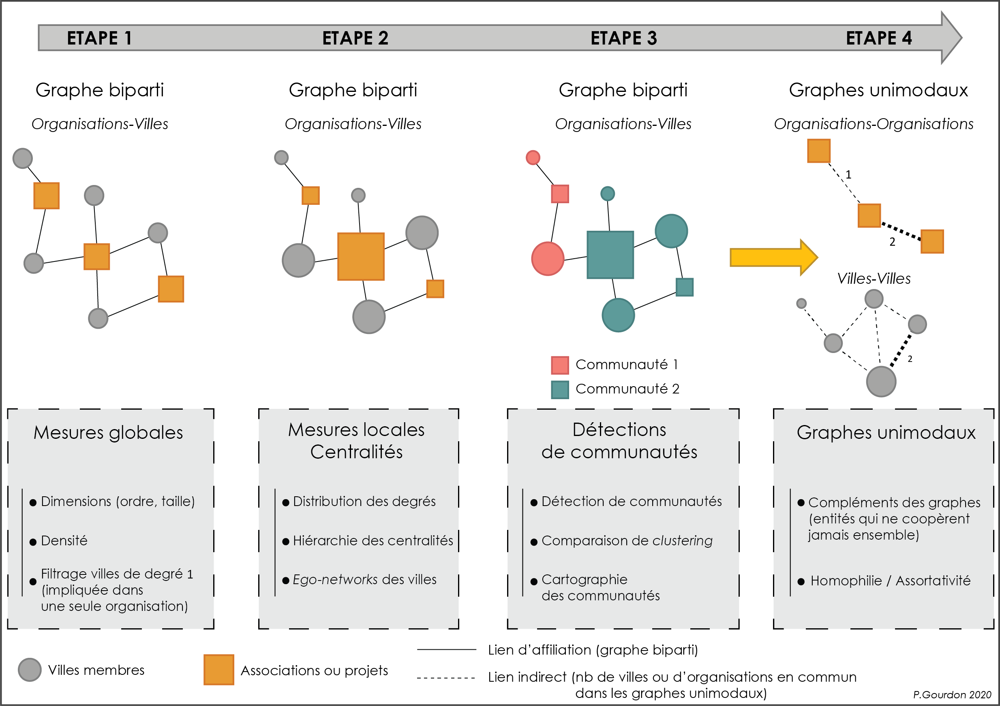

## Main goal and Data Description

Build the first network analyses on bipartite organization-city graphs and dual projection.
2 networks to study (data description chap2 and 3, repo chap 3): 

(1) ETMUN : [ETMUN_Inter](ETMUN_Inter/)

(2) EUCICOP : [EUCICOP_inter](EUCICOP_inter/)

## General Workflow

For each network, we proceed in 4 steps

(1) Creation of relational data (igraph, incidence matrix) and main numerical summaries (dimensions, basic global indexes). Carrying out data filtering (level 1 cities or/and multiple affiliations of a city in the same organization)

(2) Local measures and centralities : degree distribution in 2-mode networks, ego-networks

(3) Community detection on 2-mode networks : directly on bipartite + dual projection. Cartography of cities'communities

(4) Dual projection : complement of networks + assortativity

Here a sum-up (in french)

{width=100%}

